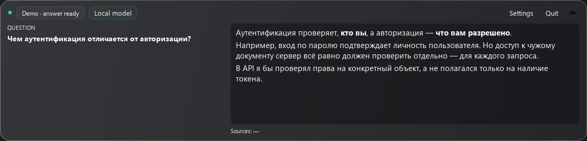
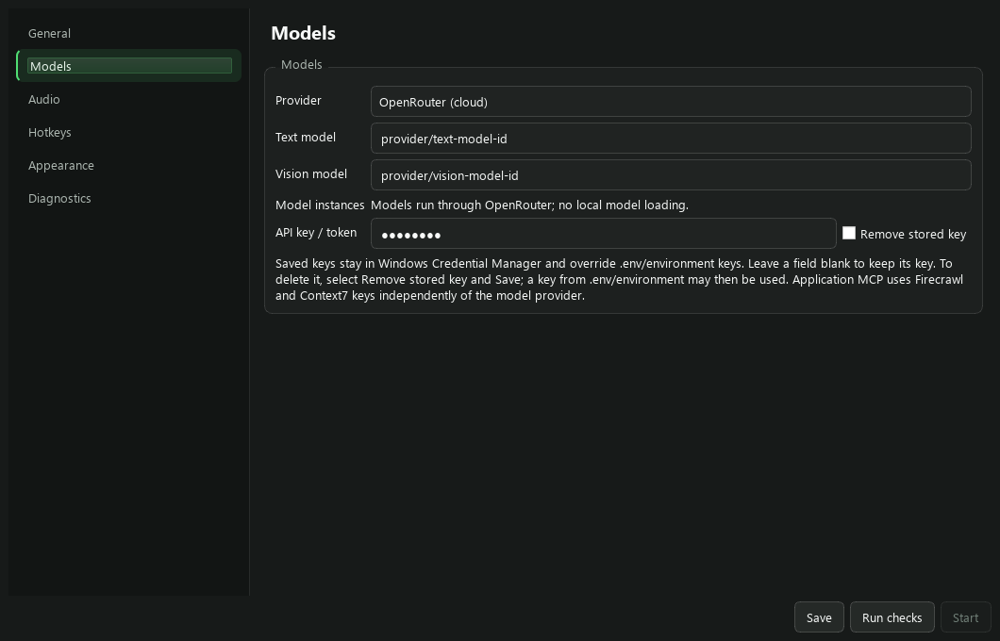
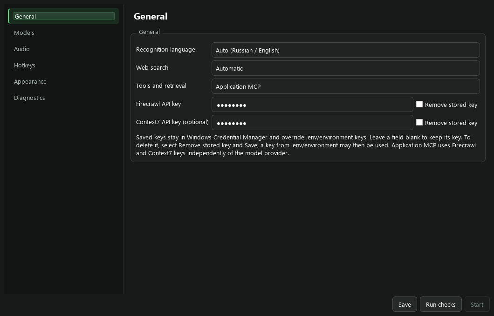
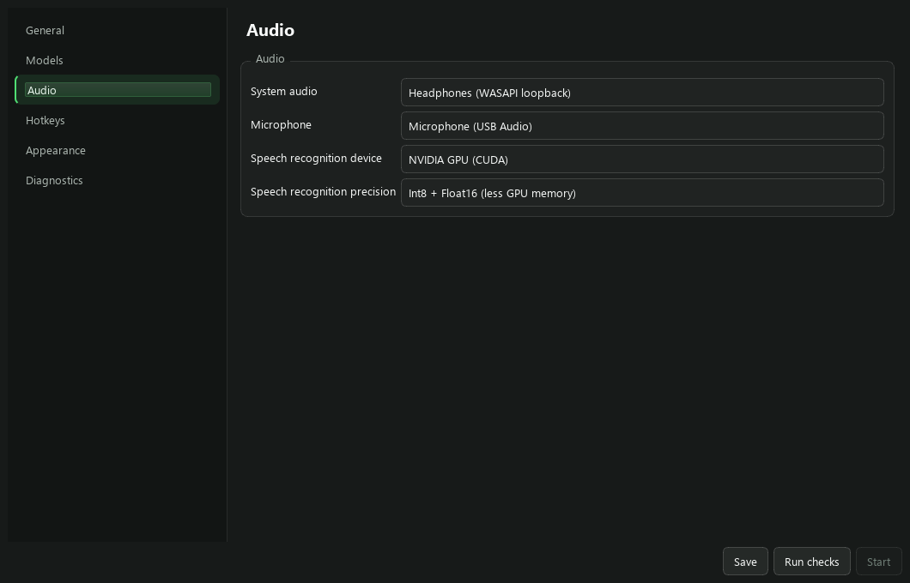

# Interview Assistant


Windows-приложение для тренировки интервью и учебных демонстраций по кибербезопасности. Оно распознаёт речь собеседника и пользователя, выделяет вопросы и показывает потоковый ответ модели в компактной панели. Используйте его с согласия участников и в рамках правил занятия или интервью.

**[Скачать установщик — Releases](https://github.com/BLNCname/interview-assistant/releases/latest)** · [Требования к GPU и VRAM](docs/HARDWARE_RU.md) · [Запуск и сборка из исходников](docs/BUILD_RU.md)

Распознавание работает локально на встроенной модели `large-v3-turbo`. Для ответов можно выбрать **OpenRouter** или **LM Studio**. Поиск через официальные **Firecrawl MCP** и **Context7 MCP** встроен в приложение: отдельные MCP-плагины и Node.js не нужны. Все четыре ключа вводятся в интерфейсе; `.env` для обычной установки не требуется.

## Возможности

- Раздельное распознавание системного звука и микрофона: собеседник и пользователь.
- Русский, английский и автоматический выбор языка.
- Краткие ответы в разговорном стиле; промпт просит не выдумывать личный опыт кандидата.
- Поиск в интернете через Firecrawl и документации библиотек через Context7.
- Ручные скриншоты и захват по типу вопроса для модели с поддержкой изображений.
- Автономные самопроверки при запуске и отдельная диагностика оборудования и сервисов.



Скриншоты инструкции сняты с виджетов приложения с демонстрационными настройками. Настоящих ключей на них нет; ответ на иллюстрации подготовлен для примера.

## 1. Требования

| Компонент | Требование |
|---|---|
| ОС | Windows 11 x64 |
| Диск | Около 10 ГБ свободного места для скачивания, установки и временных файлов; модели LM Studio требуют дополнительного места |
| Звук | Системный аудиовыход и микрофон, разрешение Windows на использование микрофона |
| STT на GPU | NVIDIA с совместимым драйвером; минимальные и рекомендуемые профили — в [таблице оборудования](docs/HARDWARE_RU.md) |
| STT на CPU | Режим CPU + Int8; NVIDIA не нужна, скорость проверяется на конкретном процессоре |
| Ответы | Ключ и доступная модель OpenRouter либо API LM Studio с загруженной моделью |
| Скриншоты | Модель с поддержкой изображений в поле Vision model |

Установщик содержит Python, Qt, библиотеки CUDA/cuDNN и STT-модель. Драйвер NVIDIA, LM Studio и веса модели для генерации ответов устанавливаются отдельно. Для облачного варианта LM Studio не требуется.

Для STT рекомендуем **8 ГБ VRAM**: например, RTX 3060 Ti/4060 на настольном ПК или RTX 4060 Laptop. **6 ГБ** (RTX 2060 или RTX 4050 Laptop) — только ориентир для пробного запуска; гарантированный минимум на этих картах не измерен. Желательно оставить около 3 ГБ свободной VRAM перед загрузкой STT.

VRAM для STT и локальной LLM складываются. Для компьютера с **RTX 3060 Ti 8 ГБ** разумный старт — CUDA + Int8/Float16, ответы через OpenRouter. Физические испытания на 3060 Ti не проводились: результаты на RTX 5070 Ti не являются замером её скорости. Конкретные настольные и мобильные GPU, объём свободной памяти и ограничения приведены в [HARDWARE_RU.md](docs/HARDWARE_RU.md).

## 2. Скачать и установить

1. Откройте [последний релиз](https://github.com/BLNCname/interview-assistant/releases/latest). Если репозиторий приватный, войдите под аккаунтом с доступом к нему.
2. В **Assets** скачайте `InterviewAssistant-Setup-0.1.2-win64.exe`, **все одноимённые файлы `-*.bin`** и `SHA256SUMS.txt` в одну папку. Архивы `Source code` для установки не нужны.
3. Не переименовывайте части и не переносите `.exe` отдельно от `.bin`. Это один установщик, разделённый на файлы из-за ограничения размера вложения GitHub.
4. Проверьте файлы в PowerShell из папки загрузки:

   ```powershell
   Get-Content .\SHA256SUMS.txt | ForEach-Object {
       $parts = $_ -split '\s+', 2
       $name = $parts[1].TrimStart('*')
       if ((Get-FileHash -LiteralPath $name -Algorithm SHA256).Hash -ne $parts[0]) {
           throw "Контрольная сумма не совпала: $name"
       }
   }
   ```

5. Запустите `.exe` и пройдите мастер установки. По умолчанию используется `%LOCALAPPDATA%\Programs\InterviewAssistant`, установка для текущего пользователя.
6. Запустите **Interview Assistant** через меню «Пуск».

Учебный релиз не подписан сертификатом издателя: Windows может показать предупреждение SmartScreen. Сверяйте источник и контрольные суммы. Для обычного запуска приложения не требуется создавать входящее правило брандмауэра.

## 3. Модель и ключ провайдера

Откройте **Settings → Models**. Названия пунктов интерфейса пока английские.



### OpenRouter — без LM Studio

1. Получите ключ в [OpenRouter](https://openrouter.ai/settings/keys) и выберите доступную вашему аккаунту модель в [каталоге](https://openrouter.ai/models). Стоимость и ограничения зависят от модели и провайдера.
2. В `Provider` выберите **OpenRouter (cloud)**.
3. Вставьте ключ в `API key / token`.
4. В `Text model` введите точный ID из каталога. Поле допускает ручной ввод; значение на иллюстрации — пример, а не гарантированно доступная бесплатная модель.
5. Для скриншотов укажите модель с поддержкой изображений в `Vision model`. Для работы только с речью оставьте поле пустым.
6. Нажмите **Save**.

STT остаётся локальным. Выбранный контекст разговора и прикреплённые скриншоты отправляются в OpenRouter и далее выбранному провайдеру. Наличие ключа само по себе не гарантирует доступную квоту.

### LM Studio — локальная модель

1. Установите [LM Studio](https://lmstudio.ai/), скачайте и загрузите подходящую instruction-модель.
2. В **Developer** включите API-сервер на `127.0.0.1:1234`. Оставьте его работающим. [Официальная инструкция](https://lmstudio.ai/docs/developer/core/server).
3. Если включена аутентификация, создайте токен в настройках сервера. [Документация аутентификации](https://lmstudio.ai/docs/developer/core/authentication).
4. В ассистенте выберите **LM Studio (local)** и вставьте токен в `API key / token`. При отключённой аутентификации токен не нужен.
5. Нажмите **Save**, дождитесь окончания диагностики и обновления списка моделей. Выберите `Text model`, при необходимости `Vision model`, и сохраните снова. Кнопка **Run checks** повторяет проверку вручную.

Одну мультимодальную модель можно выбрать для обоих полей. LM Link — дополнительный вариант размещения модели на другой машине, а не обязательный компонент. Ассистент обращается к LM Studio через loopback. Нестандартный порт задаётся параметром `LMSTUDIO_PORT` в дополнительной конфигурации.

### Хранение и замена ключей

Ключи из интерфейса сохраняются в **Windows Credential Manager** для текущего пользователя под сервисом `InterviewAssistant`. Они не записываются в `config.yaml`. Поля маскируют ввод и очищаются после сохранения; пустое поле оставляет сохранённый ключ.

Чтобы заменить ключ, вставьте новый и нажмите **Save**. Для удаления отметьте `Remove stored key` и сохраните. Если дополнительно задан ключ в `.env` или переменных окружения, после удаления сохранённого ключа используется этот резервный источник.

Приоритет **секретов**: сохранённый GUI-ключ → переменная процесса → `.env`. Ключи LM Studio и OpenRouter хранятся отдельно; сохраняйте введённый ключ перед переключением провайдера.

## 4. Поиск и MCP

Откройте **Settings → General**.



1. В `Tools and retrieval` выберите **Application MCP** (встроенный клиент).
2. Вставьте ключ из [кабинета Firecrawl](https://www.firecrawl.dev/app) в `Firecrawl API key`.
3. При наличии ключа [Context7](https://context7.com/) вставьте его в `Context7 API key (optional)`. Без ключа доступ зависит от ограничений сервиса.
4. В `Web search` выберите автоматический поиск или отключите его.
5. Нажмите **Save**, затем **Run checks**.

| Сервис | Официальный адрес | Назначение |
|---|---|---|
| [Firecrawl MCP](https://docs.firecrawl.dev/mcp-server) | `https://mcp.firecrawl.dev/v2/mcp` | Интернет-поиск через firecrawl_search |
| [Context7 / Upstash](https://github.com/upstash/context7) | `https://mcp.context7.com/mcp` | Поиск библиотеки и документации |

Приложение запрашивает до пяти результатов, не запускает scrape/crawl/agent-задания. В поиск передаётся очищенный текущий вопрос, а не весь диалог или изображение. Актуальные квоты и цены смотрите в кабинете и [документации Firecrawl](https://docs.firecrawl.dev/features/search). В наших испытаниях доступ без ключа на этой сети был отклонён, поэтому для воспроизводимого запуска используйте свой ключ.

Проверка MCP устанавливает соединение и получает список инструментов; она не делает платный поиск и не подтверждает остаток кредитов. При ошибке поиска ассистент может ответить без найденных сведений. Тайм-аут не гарантирует отсутствие списания кредитов. Для медленного соединения можно задать `SEARCH_TIMEOUT_SECONDS=30`; стандартный бюджет — 5 секунд.

`Tools and retrieval → Disabled` отключает интеграции. MCP через LM Studio оставлен для совместимости; для обычной установки выбирайте Application MCP.

## 5. Звук и STT



В **Audio**:

1. `System audio` — loopback активных наушников/динамиков, в которых слышен собеседник или запись.
2. `Microphone` — отдельный вход вашего микрофона, иначе реплики могут дублироваться.
3. `Speech recognition device` — **NVIDIA GPU (CUDA)**.
4. `Speech recognition precision` — **Int8 + Float16 (less GPU memory)** для меньшего расхода VRAM. В новой конфигурации может быть выбран Float16; переключите явно.
5. В **General → Recognition language** выберите автоматическое распознавание либо русский/английский.

Без подходящей NVIDIA выберите **CPU** и **Int8**. Автоматического скрытого перехода на CPU при ошибке CUDA нет. Подробнее — [минимальная VRAM и GPU для ноутбуков и настольных ПК](docs/HARDWARE_RU.md).

## 6. Проверка и первый запуск

1. Нажмите **Save**, затем **Run checks**.
2. Откройте **Diagnostics**. Проверяется звук, STT с распознаванием коротких RU/EN-фраз, провайдер, модели, MCP, захват и горячие клавиши.
3. Первая загрузка STT в память занимает больше времени. Проверка модели может послать короткий запрос провайдеру.
4. Исправьте строки с ошибками, повторите проверку и нажмите **Start**, когда кнопка станет доступной.
5. Включите запись интервью или начните согласованную тренировку. Если вопрос не обнаружен автоматически, нажмите `Ctrl+Shift+Space`.

При обычном старте выполняются быстрые автономные проверки логики. Полный `pytest` при каждом запуске не выполняется. Успешная самопроверка не заменяет **Run checks** с настоящим оборудованием и ключами.

## Управление и скриншоты

Все сочетания изменяются в **Settings → Hotkeys**.

| Действие | По умолчанию |
|---|---|
| Ответить по текущему контексту | Ctrl+Shift+Space |
| Скриншот для следующего запроса | Ctrl+Shift+S |
| Пауза / продолжение распознавания | Ctrl+Shift+P |
| Скрыть / показать панель | Ctrl+Shift+O |
| Режим перемещения и изменения размера панели | Ctrl+Shift+I |
| Веб-поиск для следующего вопроса | Ctrl+Shift+W |
| Очистить ответ и историю | Ctrl+Shift+C |

Панель пропускает клики в обычном режиме. Для перемещения, изменения размера, выделения текста и прокрутки включите редактирование через `Ctrl+Shift+I`. Скрытие панели не останавливает STT: для этого используйте паузу. Выход — через значок в области уведомлений Windows.

**Ручной скриншот:** нажмите `Ctrl+Shift+S`, дождитесь готовности и отправьте следующий вопрос. Изображение прикрепляется однократно. Захватывается рабочий стол со всеми мониторами — заранее уберите лишние личные данные.

**Автоскриншот:** создаётся для вопросов, определённых как код, проектирование системы или анализ экрана, если выбран `Vision model`. Это захват по событию, а не таймер. Для конкретного кадра используйте ручную клавишу. Чёрные/защищённые кадры отклоняются; пригодный неизменившийся кадр может использоваться повторно.

Панель использует исключение из захвата Windows. Поведение зависит от ОС и программы записи; это не универсальная гарантия невидимости и не заменяет согласие участников.

## Дополнительно: .env

Для стандартной установки этот файл не нужен. Шаблон — [`.env.example`](.env.example). Создайте `.env` рядом с установленным `InterviewAssistant.exe` либо рядом с используемым `config.yaml`. Не сохраняйте его как `.env.txt`.

Обычная конфигурация находится в `%LOCALAPPDATA%\InterviewAssistant\InterviewAssistant\config.yaml`.

Приоритет **несекретных** параметров: переменные процесса → `.env` → YAML. Если выбранный в GUI режим после перезапуска меняется обратно, удалите соответствующее переопределение из `.env`. Для секретов сохранённый GUI-ключ имеет более высокий приоритет.

`MCP_CONFIG` задаёт собственные доверенные определения серверов вместо встроенных. Поддерживаются контракты firecrawl/context7; [образец](config/mcp.template.json). Команды локальных серверов запускаются с правами пользователя. Для обычной установки файл не нужен.

## Решение проблем

| Симптом | Что проверить |
|---|---|
| Start недоступна | Save → Run checks, ошибки в Diagnostics |
| CUDA/STT не готовы | Драйвер, свободная VRAM; CUDA + Int8/Float16 либо CPU + Int8. Не копируйте случайные DLL |
| Нет ответа | API и ID модели LM Studio либо ключ, квота и модель OpenRouter |
| Нет моделей LM Studio | Сервер должен работать; сохраните токен и повторите проверку |
| Нет голоса собеседника | Выбранный loopback должен соответствовать текущему устройству вывода Windows |
| Замена ключа не применяется | Save → Run checks. После удаления GUI-ключа проверьте резервный ключ в .env/окружении |
| Поиск недоступен | Ключ, баланс, лимиты, интернет; при медленном соединении увеличьте SEARCH_TIMEOUT_SECONDS |
| Скриншот не учитывается | Поддержка изображений у Vision model; после захвата нужен следующий запрос |
| Установщик просит часть | Скачайте все .bin того же релиза рядом с .exe, сохранив имена |

Автономная диагностика из папки установленного приложения:

```powershell
.\InterviewAssistant.exe --self-test
.\InterviewAssistant.exe --diagnostics --no-gui --diagnostics-output .\diagnostics.json
```

## Ограничения и испытания

Контекст ограничен: последние реплики и предыдущий ответ сокращаются по бюджету. **Семантического сжатия диалога отдельным агентом сейчас нет**; старые факты могут теряться. Модель может ошибаться даже после поиска, поэтому содержание ответов нужно проверять.

В [нагрузочных испытаниях](docs/validation/stress-and-release-2026-09-08.md) конкретной конфигурации LM Studio сложные вопросы дали первый текст за 7,3–13,6 с и полный ответ за 10,3–18,2 с. Серия поиска списала 12 кредитов Firecrawl. Это результаты отдельного прогона, а не гарантии скорости и расхода. OpenRouter с реальным ключом не испытывался; интеграция проверена автоматическими контрактными тестами.

Другие отчёты: [STT и записи](docs/validation/recording-replay-2026-09-07.md), [качество ответов](docs/validation/heavy-answer-quality-2026-09-08.md), [релиз 0.1.2](docs/validation/release-0.1.2.md).

Для удаления: **Параметры Windows → Приложения → Interview Assistant → Удалить**. Конфигурация и ключи могут сохраняться для переустановки; при необходимости удалите ключи через Settings перед удалением приложения.
